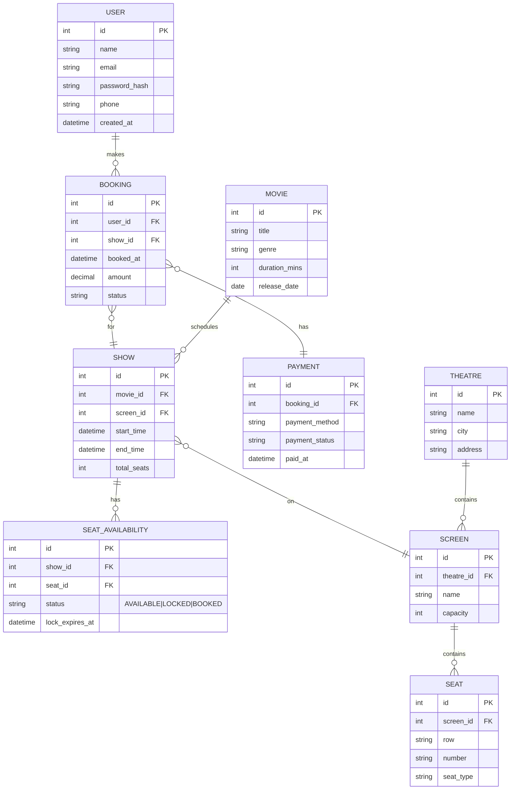

📽️ BooKMyShowProject2025
A backend movie-ticket booking platform (Low-Level Design) built with Java + Spring Boot

🌟 Overview
This project is a low-level design and implementation of a movie-ticket booking system similar to BookMyShow. It focuses on:

Clear backend architecture

Efficient data modeling

Robust API design

Real-world booking flow & concurrency challenges

🚀 Tech Stack
Java 17+ — Core language

Spring Boot 3.x — REST API development

Maven — Build & dependency management

MySQL (or H2 in-memory) — Persistent storage

JPA/Hibernate — ORM for DB operations

Postman / RestAssured — API testing

JUnit + Mockito (Planned) — Automated unit testing

Docker (Future) — Deployment packaging

🧩 Features
User Authentication — Secure signup/login

Browse Movies & Theatres — Filter by movie or location

Show & Screen Management — Admin feature to schedule shows

Seat Selection & Booking — User can lock & confirm seats

Simulated Payment Gateway — Fake payment integration for bookings

Booking History — Retrieve past bookings

Concurrency Handling (In Progress) — Prevent double booking

⚙️ Architecture
Layered Approach:

nginx
Copy
Edit
Controller → Service → Repository → Database
Controller — REST endpoints

Service — Business logic

Repository — DB access using JPA

Entity — Database model

Exception — Custom error handling

🗃️ Database Design
Key Tables:

User — User details

Movie — Movie information

Theatre — Theatres & locations

Screen — Screens in each theatre

Show — Movie timings & screen assignments

Seat — Seat layout

Booking — User bookings

Payment — Transaction records

Relationships:

One Theatre → Many Screens

One Screen → Many Shows

One Show → Many Seats

One User → Many Bookings

(ER Diagram — To be added)

📜 Booking Flow
User logs in

Selects a movie & theatre

Picks a show time & seats

Seat lock applied (to prevent race conditions)

Simulated payment processed

Booking confirmed & stored in DB

🧪 Testing
Postman Collection — Manual API testing

RestAssured Scripts (Planned) — Automated API verification

JUnit/Mockito (Planned) — Unit & integration tests

🛠️ How to Run Locally
bash
Copy
Edit
# Clone repository
git clone https://github.com/pujerisantosh/BooKMyShowProject2025.git
cd BooKMyShowProject2025

# Build & run
./mvnw spring-boot:run
App runs on http://localhost:8080

📦 Future Improvements
✅ Implement Redis-based distributed seat locking

✅ Add Dockerfile & Docker Compose setup

✅ Deploy to AWS ECS/Elastic Beanstalk

✅ Add caching for movie listings

✅ Integrate with email/SMS notifications

# BooKMyShowProject2025 — ER Diagram & Architecture Diagram

This document contains two ready-to-use diagrams (Mermaid) you can paste into your README.md or render with any Mermaid-capable viewer. Also included: concise SQL table schemas, diagram image export suggestions, and where to place files in your repo.

---

## 1) ER Diagram (Mermaid)



**Notes (ER):**

* `SEAT_AVAILABILITY` captures seat status per show (important for locking logic).
* `BOOKING.status` = {PENDING, CONFIRMED, CANCELLED, FAILED}.
* `SEAT.type` supports pricing tiers (REGULAR, PREMIUM, VIP).

---

## 2) Architecture Diagram (Mermaid Flowchart)

```mermaid
flowchart TD
  subgraph Client
    A[Web / Mobile UI]
  end

  subgraph APIGW[API Gateway / Load Balancer]
    direction TB
    B[Ingress LB / API Gateway]
  end

  subgraph App[Backend Services]
    direction LR
    S1[Auth Service]
    S2[User Service]
    S3[Movie & Catalogue Service]
    S4[Show & Screen Service]
    S5[Booking Service]
    S6[Payment Service]
    S7[Notification Service]
  end

  subgraph Infra[Infrastructure]
    DB[(Relational DB - MySQL)]
    REDIS[(Redis Cache / Distributed Lock)]
    S3[Object Storage - S3]
    MQ[(Optional) Message Queue - SNS/SQS or Kafka]
  end

  A --> B
  B --> S1
  B --> S2
  B --> S3
  B --> S4
  B --> S5
  B --> S6

  S5 --> DB
  S3 --> DB
  S4 --> DB
  S2 --> DB
  S1 --> DB
  S6 --> DB

  S5 -- uses lock --> REDIS
  S5 -- emits events --> MQ
  S6 -- emits events --> MQ
  S5 -- store artifacts --> S3
  S7 -- subscribes to --> MQ
  S7 --> (Email/SMS Provider)
```

**Design Highlights:**

* **API Gateway / Load Balancer** routes client requests to backend services.
* **Booking Service** is the core: coordinates seat availability (via `SEAT_AVAILABILITY` table), uses **Redis** for distributed locks (or optimistic locking) and writes final state to DB.
* **Payment Service** handles payment flow (can be synchronous or async) and updates `BOOKING` status.
* **Message Queue** (optional) enables async notifications, audit events, and downstream processing (e.g., refunds, analytics).
* **S3/Object Storage** for storing artifacts such as invoices, tickets (PDFs), or logs.

---

## 3) SQL Table Snippets (Starter)

```sql
CREATE TABLE user (
  id BIGINT PRIMARY KEY AUTO_INCREMENT,
  name VARCHAR(200),
  email VARCHAR(255) UNIQUE,
  password_hash VARCHAR(255),
  phone VARCHAR(30),
  created_at TIMESTAMP DEFAULT CURRENT_TIMESTAMP
);

CREATE TABLE movie (
  id BIGINT PRIMARY KEY AUTO_INCREMENT,
  title VARCHAR(255),
  genre VARCHAR(100),
  duration_mins INT,
  release_date DATE
);

CREATE TABLE theatre (
  id BIGINT PRIMARY KEY AUTO_INCREMENT,
  name VARCHAR(255),
  city VARCHAR(100),
  address VARCHAR(500)
);

CREATE TABLE screen (
  id BIGINT PRIMARY KEY AUTO_INCREMENT,
  theatre_id BIGINT,
  name VARCHAR(100),
  capacity INT,
  FOREIGN KEY (theatre_id) REFERENCES theatre(id)
);

CREATE TABLE seat (
  id BIGINT PRIMARY KEY AUTO_INCREMENT,
  screen_id BIGINT,
  row_label VARCHAR(10),
  seat_number VARCHAR(10),
  seat_type VARCHAR(50),
  FOREIGN KEY (screen_id) REFERENCES screen(id)
);

CREATE TABLE show (
  id BIGINT PRIMARY KEY AUTO_INCREMENT,
  movie_id BIGINT,
  screen_id BIGINT,
  start_time DATETIME,
  end_time DATETIME,
  total_seats INT,
  FOREIGN KEY (movie_id) REFERENCES movie(id),
  FOREIGN KEY (screen_id) REFERENCES screen(id)
);

CREATE TABLE seat_availability (
  id BIGINT PRIMARY KEY AUTO_INCREMENT,
  show_id BIGINT,
  seat_id BIGINT,
  status VARCHAR(20), -- AVAILABLE | LOCKED | BOOKED
  lock_expires_at DATETIME NULL,
  FOREIGN KEY (show_id) REFERENCES show(id),
  FOREIGN KEY (seat_id) REFERENCES seat(id)
);

CREATE TABLE booking (
  id BIGINT PRIMARY KEY AUTO_INCREMENT,
  user_id BIGINT,
  show_id BIGINT,
  booked_at DATETIME DEFAULT CURRENT_TIMESTAMP,
  amount DECIMAL(10,2),
  status VARCHAR(20),
  FOREIGN KEY (user_id) REFERENCES user(id),
  FOREIGN KEY (show_id) REFERENCES show(id)
);

CREATE TABLE payment (
  id BIGINT PRIMARY KEY AUTO_INCREMENT,
  booking_id BIGINT,
  payment_method VARCHAR(50),
  payment_status VARCHAR(50),
  paid_at DATETIME,
  FOREIGN KEY (booking_id) REFERENCES booking(id)
);
```

---

## 4) Seat Locking Options (Implementation Notes)

* **Optimistic DB Locking**: Use version column (`@Version`) in JPA to detect concurrent updates — easy but requires retries.
* **Pessimistic DB Locking**: `SELECT ... FOR UPDATE` within a transaction — simpler but can impact DB throughput.
* **Redis Distributed Lock**: Use Redisson or `SETNX` pattern with TTL to lock seat keys (`seat:{showId}:{seatId}`), and fallback to DB to persist final state.
* **Combination**: Lock in Redis first (short TTL), then perform DB transaction with optimistic lock before committing.

Recommended: **Redis lock + DB optimistic update** — balances performance and correctness.

---

## 5) Files to Add to Repo

* `/docs/er-diagram.md` → include the ER mermaid block
* `/docs/architecture.md` → include the architecture mermaid block
* `/diagrams/er-diagram.png` and `/diagrams/architecture.png` → export Mermaid to PNG (tools: mermaid-cli or online editor) and commit
* `/sql/schema.sql` → add SQL snippets

---

## 6) How to Export Mermaid Diagrams to PNG (quick)

Option A: **Mermaid Live Editor**

1. Paste the mermaid block into [https://mermaid.live](https://mermaid.live)
2. Click **Export** → PNG or SVG
3. Save into `/diagrams` and commit

Option B: **mermaid-cli (npm)**

```bash
npm i -g @mermaid-js/mermaid-cli
mmdc -i docs/er-diagram.mmd -o diagrams/er-diagram.png
```

---

## 7) Next Steps I Can Help With

* Generate PNGs from these diagrams and provide them for you to commit.
* Create a polished README snippet that embeds the diagrams and SQL schema.
* Implement a sample Redis-based seat-locking Java service (code + tests).

---

*If you want the exported PNGs now, tell me and I will produce them for you to add to the repo.*


📌 Author
Santosh Kumar Pujeri
📧 Email: your-email@example.com
💼 LinkedIn: linkedin.com/in/pujerisantosh
📂 GitHub: github.com/pujerisantosh

